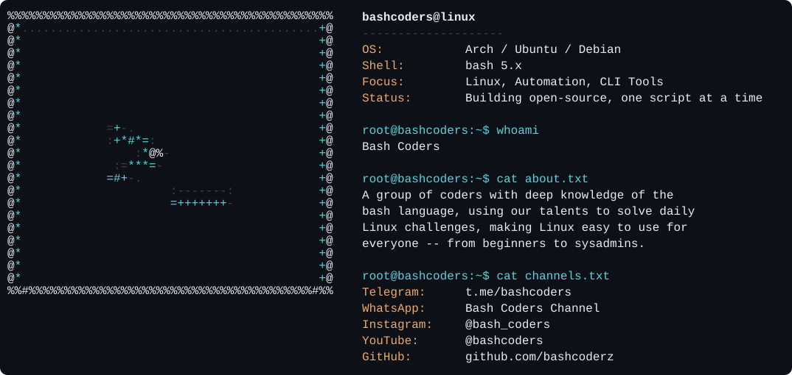

<div align="center">



</div>

<h1 align="center">Bash Coders</h1>
<p align="center"><i>Your Gateway to Learn Linux — from Foundation to System Administration and Automation</i></p>

<p align="center">
  
</p>

---

### 🔴 What We Do

-  Bash Scripting & Shell Automation
-  Linux System Administration
-  Command-Line Tooling
-  Daily Linux Challenges & Walkthroughs
-  Open Source Contribution
-  Foundation-to-Advanced Linux Tutorials

> _"Join us on a journey of continuous learning and discovery — we stand by our belief in open-source projects."_

---

### 🌐 Follow Us

<p align="center">
  <a href="https://t.me/bashcoders">
    
  </a>
  <a href="https://whatsapp.com/channel/0029Vb6vmDfKWEKvF8vxtU0j">
    
  </a>
  <a href="https://www.instagram.com/bash_coders?igsh=dW5ybHMwZGR1a204">
    
  </a>
  <a href="https://youtube.com/@bashcoders?si=DAd4qRCGTpzNVvUN">
    
  </a>
<p align="center">
  <a href="https://github.com/bashcoderz/">
    
  </a>
</p>

---

### 📊 GitHub Statistics

<p align="center">
  
  
</p>

<!-- <p align="center"><i>Shows Total Contributions · Current Streak · Longest Streak.</i></p> -->

---

### 💻 Programming Languages

<p align="center">
  
  
  
  
</p>

---

### 🛠️ Tech Infrastructure

<p align="center">
  
  
  
  
  
</p>

---

<div align="center">

```
root@bashcoders:~$ echo "Learn. Script. Automate. Repeat."
Learn. Script. Automate. Repeat.
root@bashcoders:~$ █
```

</div>

<p align="center">
  
</p>
